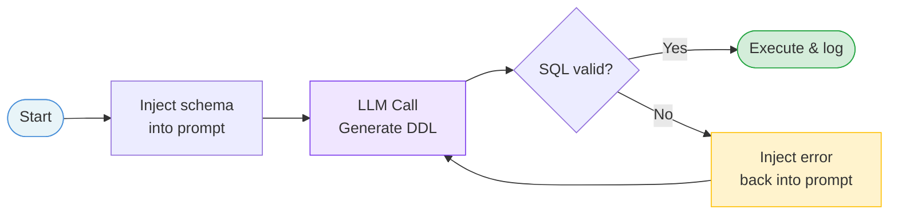
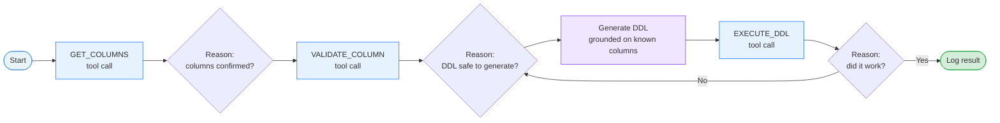
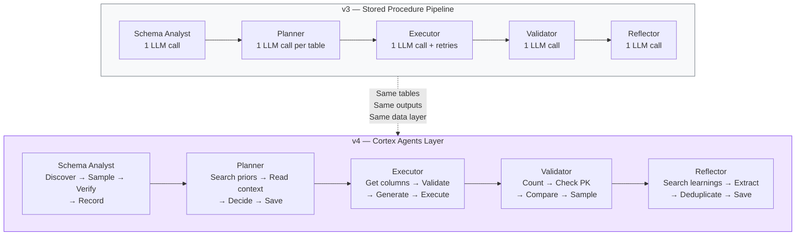
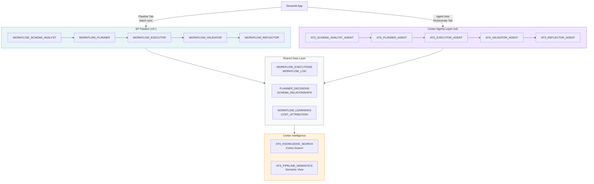
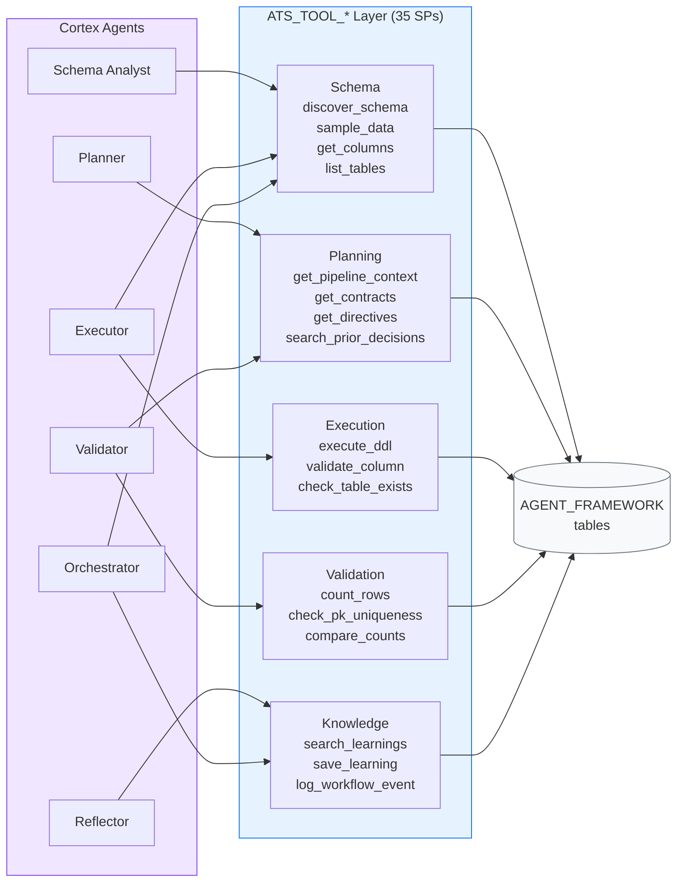
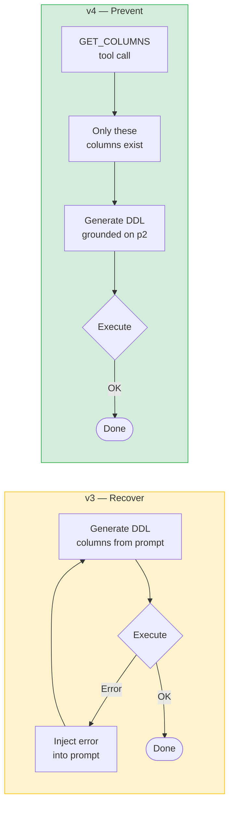

# v3 → v4 Architecture Shift

> **The one-sentence version:**
> v3 is a pipeline of stored procedures where each phase makes one LLM call and moves on. v4 keeps that pipeline and adds a Cortex Agents layer alongside it — each phase now has an agent that can invoke tools, verify its own assumptions, and reason across multiple steps before committing to an action.

---

## What Actually Changed

The v3 pipeline works. It ships Silver tables. It has a retry loop when the LLM makes a mistake. That pipeline is still running in v4, unchanged.

What v4 adds is a second execution path sitting alongside it — a layer of Cortex Agents where each phase can think before it acts. The agents don't replace the SPs. They use the same tables, write to the same logs, and produce the same outputs. The difference is *how* they arrive at the result.

---

## The Core Shift: One Call vs. A Reasoning Loop

In v3, the Executor phase works like this:

The LLM gets one shot. If it fails, the error is fed back and it tries again. The retry loop eventually recovers, but it starts blind — the LLM guesses column names from training patterns rather than from the actual schema.

In v4, the Executor Agent works like this:

The agent **never generates DDL without first confirming the column list exists**. The reasoning loop between tool calls is where the intelligence lives — not in a bigger prompt, but in grounded, sequential verification.

---

## What This Looks Like Per Phase

Each phase in v3 makes one LLM call. Each agent in v4 makes multiple tool calls with reasoning between them:

---

## The Dual-Path Architecture

Both paths write to the same data layer. The SP pipeline is the fast, reliable, batch path. The Agent path is the interactive, exploratory, grounded path. You can mix and match — run the SP Planner for speed, then hand off to the Executor Agent for a table that keeps failing.

---

## The Tool Layer: How Agents Access Data

The 35 `ATS_TOOL_*` stored procedures are the connective tissue between the agents and the data layer. Every tool follows the same contract: named input parameters, JSON output, callable by both agents and SPs directly.

Adding a new capability means adding one `ATS_TOOL_*` SP. Every agent that references it gets the capability immediately — no changes to agent logic required.

---

## Prevent vs. Recover

The clearest way to see the architectural impact is the retry count:

| Version | Column hallucination approach | Avg retries/table | Clean run result |
|---------|-------------------------------|------------------|-----------------|
| v2 | LLM guesses from training patterns | 2.4 | 15% first-run accuracy |
| v3 | Inject column list into prompt — LLM still interprets it | 0.8 | 75% first-run accuracy |
| v4 | Agent calls `GET_COLUMNS` tool → only knows columns that exist | **0.0** | 100% (5/5 tables) |

v3 tells the LLM what columns exist. v4 makes it impossible for the agent to reference a column it hasn't confirmed through a tool call first.

---

## Summary

| Dimension | v3 | v4 |
|-----------|----|----|
| **Execution model** | One LLM call per phase | Agent loop — tool calls + reasoning steps |
| **Column accuracy** | Prompt injection (LLM interprets) | Tool-grounded (agent fetches, then generates) |
| **Error handling** | Retry after failure | Prevent before execution |
| **Entry points** | SP pipeline only | SP pipeline + Agent path (shared data layer) |
| **Extensibility** | Edit a stored procedure | Add one `ATS_TOOL_*` SP |
| **Retries on clean run** | 0.8 avg | 0.0 |
| **Interactive exploration** | None | Agent Hub — converse with any phase agent directly |
